# NST Interview Prep Portal

A unified data-driven portal with two distinct use cases — helping NST students prepare for technical interviews at specific companies, and helping faculty align the B.Tech CS & AI curriculum with what industry actually tests and hires for.

---

## Project Overview

Both use cases are powered by the same underlying data infrastructure: structured datasets about technical interview questions, hiring patterns, and in-demand skills scraped and curated from public sources.

### Use Case 1: Company-Specific Interview Prep Portal (Student-Facing)

An intelligent, structured guide that answers questions like:
- What topics does Google typically test in its SDE interviews?
- What is the typical interview format at a company like Amazon or Flipkart?
- What LeetCode-style problem categories appear most frequently at a given company?
- Are there common system design or behavioral questions for a particular role?

### Use Case 2: Curriculum Intelligence Dashboard (Faculty-Facing)

An internally-facing tool for faculty and academic planners that answers:
> *Are the skills we teach in our B.Tech CS & AI curriculum aligned with what companies actually test and hire for?*

Concretely, this means mapping structured interview data — topics, skills, problem types — against the existing course syllabus to produce a **gap analysis**: topics industry expects but aren't taught, and topics heavily covered that may have lower industry relevance.

---

## Data Sources

> **Students — we need your help expanding this list!**
> Found a useful source not listed here? Open a PR and add it to the appropriate table below. See [Contributing a Data Source](#contributing-a-data-source) at the bottom of this page.

### DSA & Coding Problem Platforms

| Source | What It Contains |
|--------|-----------------|
| [GeeksForGeeks](https://www.geeksforgeeks.org) | Company-tagged DSA problems, interview experiences, topic-wise questions |
| [LeetCode Discuss](https://leetcode.com/discuss) | Company-tagged problems, community interview reports |
| [InterviewBit](https://www.interviewbit.com) | Topic and company-wise structured problem sets |
| [HackerRank](https://www.hackerrank.com) | Role-based coding challenges, company-sponsored contests |
| [HackerEarth](https://www.hackerearth.com) | Coding challenges, campus hiring contest archives |
| [CodeChef](https://www.codechef.com) | Competitive programming problems, company hiring contests |
| [Codeforces](https://codeforces.com) | Competitive programming problem archive |
| [AlgoExpert](https://www.algoexpert.io) | Curated interview problems with video explanations |
| [NeetCode](https://neetcode.io) | Curated LeetCode roadmap by topic and company |
| [Coding Ninjas](https://www.codingninjas.com) | Company-wise DSA problems, very popular in Indian colleges |
| [Educative.io](https://www.educative.io) | Grokking series — system design, coding patterns |

### Indian Placement & Job Portals

| Source | What It Contains |
|--------|-----------------|
| [AmbitionBox](https://www.ambitionbox.com) | Indian company-specific interview experiences and questions |
| [Naukri.com](https://www.naukri.com) | Job postings with skill tags relevant to Indian tech market |
| [PrepInsta](https://prepinsta.com) | Company-wise placement papers, aptitude & coding questions |
| [IndiaBix](https://www.indiabix.com) | Aptitude, verbal, technical MCQs — widely used for campus prep |
| [FacePrep](https://www.faceprep.in) | Company-specific placement prep, mock tests |
| [CareerRide](https://www.careerride.com) | Interview questions by company and technology |
| [Freshersworld](https://www.freshersworld.com) | Fresher job listings, off-campus drives, placement papers |
| [Workat.tech](https://workat.tech) | Indian startup interview experiences, DSA practice |
| [Instahyre](https://www.instahyre.com) | Indian tech hiring, skill-based job matching |

### Company Reviews & Interview Experiences

| Source | What It Contains |
|--------|-----------------|
| [Glassdoor](https://www.glassdoor.com) | Interview reviews, question logs by company and role, difficulty ratings |
| [Blind / TeamBlind](https://www.teamblind.com) | Anonymous tech worker posts — interview experiences, offers, comp data |
| [Levels.fyi](https://www.levels.fyi) | Compensation data + interview difficulty ratings by company and level |
| [Prepfully](https://prepfully.com) | Interview experiences and mock interview reviews |
| [CareerCup](https://www.careercup.com) | Interview questions shared by candidates, organized by company |

### Job Listings & Skills Intelligence

| Source | What It Contains |
|--------|-----------------|
| [LinkedIn Jobs](https://www.linkedin.com/jobs) | Job descriptions, required skills by company and role |
| [Indeed](https://www.indeed.com) | Job postings with skill requirements, salary estimates |
| [Wellfound (AngelList)](https://wellfound.com) | Startup job listings with explicit tech stack and skill requirements |
| [Cutshort](https://cutshort.io) | Indian tech hiring — skill-tagged job listings |

### Community & Discussion

| Source | What It Contains |
|--------|-----------------|
| [Reddit — r/cscareerquestions](https://www.reddit.com/r/cscareerquestions) | Anecdotal interview experiences, FAANG prep threads |
| [Reddit — r/india](https://www.reddit.com/r/india) | Indian company interview experiences, placement discussions |
| [Reddit — r/developersIndia](https://www.reddit.com/r/developersIndia) | Indian dev community — job prep, interview experiences |
| [Quora](https://www.quora.com) | Interview experience Q&As, company-specific threads |

### Curated Repositories & Open Content

| Source | What It Contains |
|--------|-----------------|
| [GitHub Repos](https://github.com) | Curated interview prep repos (e.g. awesome-interview-questions, system-design-primer) |
| [System Design Primer](https://github.com/donnemartin/system-design-primer) | Comprehensive system design interview resource |
| [Tech Interview Handbook](https://www.techinterviewhandbook.org) | Structured guide — algorithms, behavioral, offers |
| [NeetCode.io Roadmap](https://neetcode.io/roadmap) | Structured DSA roadmap with company frequency tags |

### Supplementary / Niche Sources

| Source | What It Contains |
|--------|-----------------|
| [GreatFrontEnd](https://www.greatfrontend.com) | Frontend-specific interview questions (HTML, CSS, JS, React) |
| [ByteByByte](https://www.byte-by-byte.com) | Algorithm interview breakdowns with solutions |
| [interviewing.io](https://interviewing.io) | Mock interview recordings and feedback (public blog posts) |
| Company Engineering Blogs | Tech blogs from Google, Meta, Uber, etc. — insight into problem-solving culture |

### Data Fields Captured

- Company name and role/level (e.g., SDE-1, SDE-2, Data Analyst)
- Interview round type (technical coding, system design, HR, managerial)
- Topic/skill area (e.g., Dynamic Programming, OS, DBMS, Machine Learning)
- Problem statement or question summary
- Source URL and date of collection
- Difficulty level (Easy / Medium / Hard, if available)
- Frequency/recurrence signal (how often a topic/question appears)

---

## Technical Pipeline

```mermaid
flowchart TD
    subgraph SOURCES["Data Sources (35+)"]
        S1[GeeksForGeeks]
        S2[LeetCode Discuss]
        S3[AmbitionBox]
        S4[Glassdoor]
        S5[InterviewBit]
        S6[Coding Ninjas / PrepInsta]
        S7[LinkedIn / Naukri]
        S8[Reddit / Quora]
        S9[GitHub Repos]
    end

    subgraph STAGE1["Week 1 — Source Discovery & Extraction"]
        A1[/"Check ToS & robots.txt"/]
        A2["Assess Scrapability
Static HTML vs JS-rendered"]
        A3["Build Scrapers & Parsers
BeautifulSoup · Selenium · Playwright
GraphQL APIs · REST APIs"]
        A4[("Raw JSON Dumps
per source")]
    end

    subgraph STAGE2["Week 2 — Ingestion & Schema"]
        B1["Schema Design
companies · roles · topics
questions · question_topics"]
        B2["Supabase / PostgreSQL
Migrations & Setup"]
        B3["ETL Pipeline
Parse JSON → Load to DB
Deduplication"]
    end

    subgraph STAGE3["Week 3 — Cleaning & Classification"]
        C1["Data Cleaning
Normalize company names
Fix encoding · Remove HTML"]
        C2["Claude API Classification
Tag: topic · difficulty
round type · skill area"]
        C3["Syllabus Mapping
Map topics → B.Tech CS & AI
course categories"]
    end

    subgraph STAGE4["Week 4 — Student Portal"]
        D1["FastAPI Backend
/companies · /topics · /questions"]
        D2["Next.js Frontend
Search · Filter · Cards"]
        D3[["Deployed on Vercel
Student Interview Prep Portal"]]
    end

    subgraph STAGE5["Week 5 — Faculty Dashboard"]
        E1["Gap Analysis Logic
Industry topics vs Syllabus topics"]
        E2["Recharts / Chart.js
Heatmaps · Bar charts"]
        E3["Supabase Auth
Faculty-only access"]
        E4[["Curriculum Intelligence
Dashboard"]]
    end

    SOURCES --> A1
    A1 --> A2
    A2 --> A3
    A3 --> A4
    A4 --> B1
    B1 --> B2
    B2 --> B3
    B3 --> C1
    C1 --> C2
    C2 --> C3
    C3 --> D1
    C3 --> E1
    D1 --> D2
    D2 --> D3
    E1 --> E2
    E2 --> E3
    E3 --> E4

    style SOURCES fill:#1e293b,stroke:#475569,color:#e2e8f0
    style STAGE1 fill:#172554,stroke:#3b82f6,color:#e2e8f0
    style STAGE2 fill:#14532d,stroke:#22c55e,color:#e2e8f0
    style STAGE3 fill:#431407,stroke:#f97316,color:#e2e8f0
    style STAGE4 fill:#4a1d96,stroke:#a855f7,color:#e2e8f0
    style STAGE5 fill:#7f1d1d,stroke:#ef4444,color:#e2e8f0
```



| Stage | Description | Status |
|-------|-------------|--------|
| 1. Source Discovery | Identify relevant websites, assess scrapability, check ToS and robots.txt | Week 1 |
| 2. Data Extraction | Build scrapers/parsers, extract raw HTML/JSON data | Week 1 |
| 3. Ingestion Pipeline | Load raw data into a staging area (files/database) | Week 2 |
| 4. Schema Design | Define structured schema for normalized interview data | Week 2 |
| 5. Data Transformation | Clean, normalize, and structure raw data | Week 2–3 |
| 6. Classification & Tagging | Tag by topic/company/role/difficulty; map to course syllabus | TBD |
| 7. Product Layer | Build views/dashboards for Use Case 1 and Use Case 2 | TBD |

---

## Repository Structure

```
NST-Interview-Prep-Portal/
├── scrapers/          # Source-specific scrapers and parsers
├── data/              # Raw and processed data
├── pipeline/          # Ingestion and transformation scripts
├── schema/            # Schema definitions
├── dashboard/         # Product layer — student and faculty views
└── docs/              # Documentation and analysis
```

---

## Getting Started

```bash
git clone https://github.com/edusatyaki/NST-Interview-Prep-Portal.git
cd NST-Interview-Prep-Portal
```

More setup instructions will be added as the project develops.

---

## Contributing a Data Source

We're actively looking for more high-quality sources. If you know a website, forum, dataset, or community that has interview questions, company hiring patterns, or skill requirements — **please add it**.

### How to contribute

1. Fork this repository
2. Add your source to the appropriate table in the [Data Sources](#data-sources) section above
3. Use this format:

```
| [Source Name](https://url.com) | One line describing what data it contains and why it's useful |
```

4. Open a Pull Request with the title: `Add data source: <Source Name>`

### What makes a good data source?
- Contains **company-specific** interview questions or experiences
- Has **topic or skill tags** (even informal ones)
- Is **publicly accessible** (no login wall, or login-only but widely accessible)
- Relevant to **Indian tech market** or **FAANG / top product companies**
- Not already listed above

> If you've personally used a resource to prep for interviews and found it useful — that's a great signal. Add it!

---

## License

This project is for educational and research purposes at NST. Data is sourced from publicly available platforms in compliance with their respective Terms of Service.
